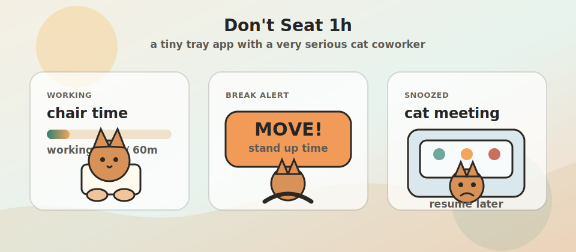

# Don't Seat 1h

A tiny Windows tray app that watches keyboard/mouse activity and nudges you to stand up after a configurable stretch of continuous work.

## Status Preview

<p align="center">
	
</p>

## Features
- A taskbar-adjacent companion bar that shows chair time, a progress bar, and a modern typing-cat animation.
- The companion bar can be dragged with the mouse, and its position is saved in the config file.
- When break time arrives, the companion bar moves to the center of the screen, grows to 2x size, and switches to a cat exercise animation.
- No Windows system toast is shown; the companion bar is the reminder.
- A cat tray icon remains available as the right-click menu entry point: typing while working, grayscale while idle, and a red pause badge while snoozed.
- Away detection resets the timer after 5 minutes of no keyboard/mouse input by default.
- Right-click menu: current chair time, snooze/resume, settings, and quit.
- Configurable thresholds are stored at `%APPDATA%/dont_seat_1h/config.json`.

## Run
```
pip install -r requirements.txt
run.bat
```
Or run it in the foreground for debugging:
```
set PYTHONPATH=src
py -3.12 -m dont_seat
```
Use `run.bat` for the normal no-console background launch. It resolves the `pythonw.exe` from the matching Python 3.12 installation.

## Keep The Tray Icon Visible
Windows decides whether a new tray icon starts in the hidden-icons overflow. A regular tray app cannot force itself to stay outside that arrow.

- The most direct option: open the hidden-icons arrow, then drag the `Don't Seat 1h` icon into the visible taskbar corner.
- The settings page name varies across Windows versions. Look for entries like `Other system tray icons`, `Taskbar corner overflow`, or `Select which icons appear on the taskbar`.
- If `Don't Seat 1h` is not listed, look for `Python` or `pythonw.exe`; in development mode the app runs through Python.
- Classic fallback command: `explorer shell:::{05d7b0f4-2121-4eff-bf6b-ed3f69b894d9}`.

## Package As Exe Optional
```
py -3.12 -m pip install pyinstaller
pyinstaller --onefile --noconsole --name DontSeat1h --paths src src/dont_seat/__main__.py
```
